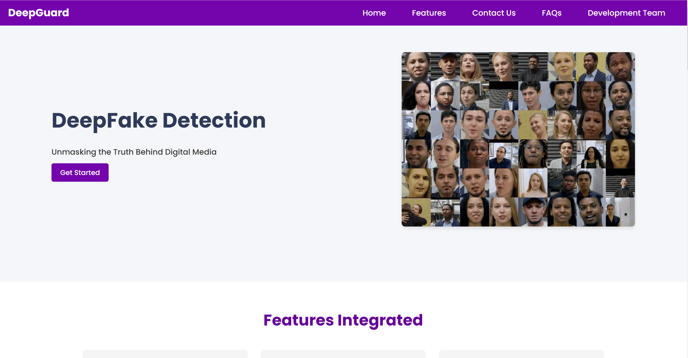
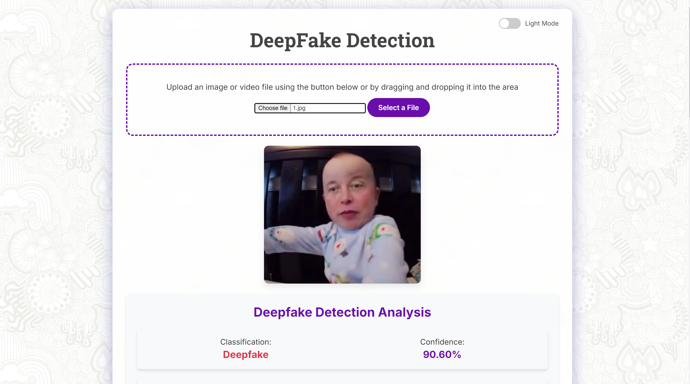
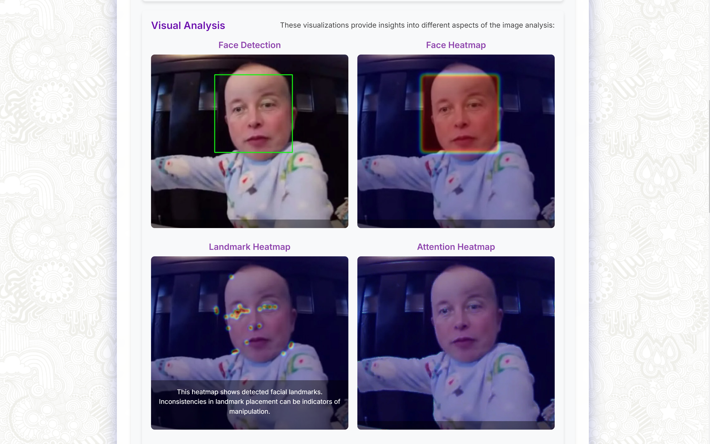
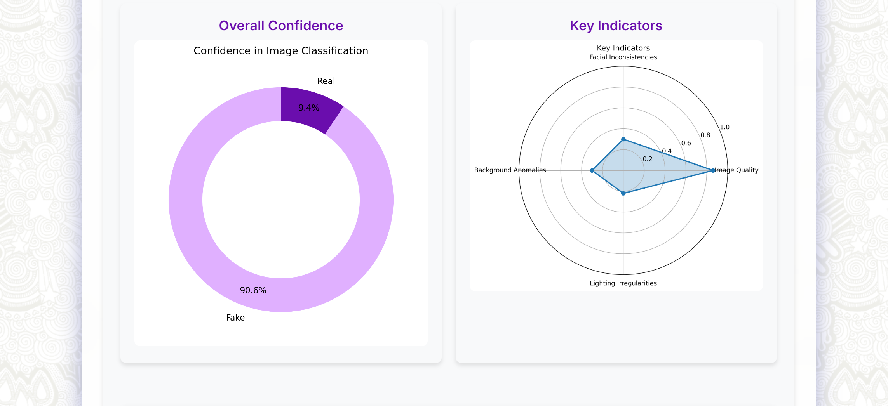
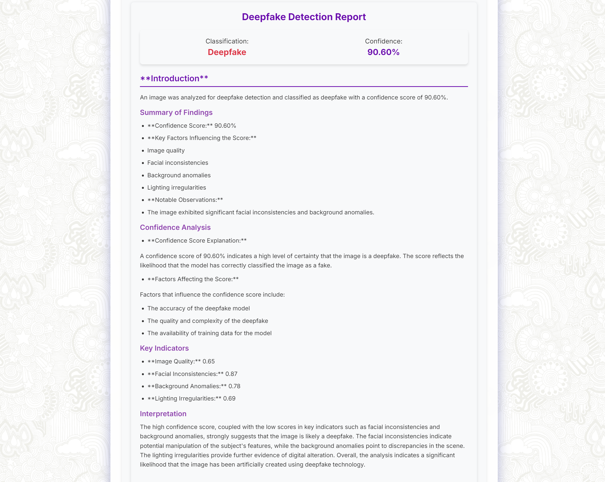

<<<<<<< HEAD
# DeepFake Detection Web Application

## Overview

This project is a web-based application for detecting deepfake images and videos using an ensemble of deep learning models. It provides a user-friendly interface for uploading media files, processes them using state-of-the-art deepfake detection algorithms, and presents the results with detailed analysis and visualization.

## Features

- **File Upload**: Supports drag-and-drop or button-click file upload for images and videos.
- **DeepFake Detection**: Utilizes an ensemble of EfficientNet-B7 models for robust deepfake detection.
- **Detailed Analysis**: Provides a comprehensive report on the authenticity of the uploaded media.
- **Visualization**: Includes donut charts for overall confidence and bar charts for specific metrics.
- **Responsive Design**: Works seamlessly on desktop and mobile devices.
- **Dark/Light Mode**: Supports theme switching for user preference.

## Project Images







## Technology Stack

- **Backend**: Python, Flask
- **Frontend**: HTML, CSS, JavaScript
- **Machine Learning**: PyTorch, timm (PyTorch Image Models)
- **Data Visualization**: Matplotlib, Plotly
- **AI-Generated Reports**: Google's Gemini API

## Installation

1. Clone the repository:

   ```
   git clone https://github.com/yourusername/deepfake-detection-app.git
   cd deepfake-detection-app
   ```

2. Set up a virtual environment (optional but recommended);

   ```
   python -m venv venv
   source venv/bin/activate  # On Windows, use `venv\Scripts\activate`
   ```

3. Install the required packages:

   ```
   pip install -r requirements.txt
   ```

4. Download the model weights and place them in the `weights` directory.

5. Set up your Gemini API key:
   - Create a `.env` file in the root directory
   - Add your API key: `GEMINI_API_KEY=your_api_key_here`

## Usage

1. Start the Flask server:

   ```
   python app.py
   ```

2. Open a web browser and navigate to `http://localhost:5000`.

3. Upload an image or video file using the interface.

4. View the detection results, including the confidence score, detailed report, and visualizations.

## Project Structure

- `app.py`: Main Flask application file
- `deepfake_model.py`: DeepFake detection model implementation
- `static/`: Contains CSS and JavaScript files
- `styles.css`: Main stylesheet
- `index.js`: Frontend JavaScript logic
- `templates/`: Contains HTML templates
- `index.html`: Main page template
- `weights/`: Directory for storing model weights (not included in repository)

## Contributing

Contributions to improve the application are welcome. Please follow these steps:

1. Fork the repository
2. Create a new branch (`git checkout -b feature-branch`)
3. Make your changes and commit them (`git commit -am 'Add some feature'`)
4. Push to the branch (`git push origin feature-branch`)
5. Create a new Pull Request


=======
# DeepFake Detection Web Application

## Overview

This project is a web-based application for detecting deepfake images and videos using an ensemble of deep learning models. It provides a user-friendly interface for uploading media files, processes them using state-of-the-art deepfake detection algorithms, and presents the results with detailed analysis and visualization.

## Features

- **File Upload**: Supports drag-and-drop or button-click file upload for images and videos.
- **DeepFake Detection**: Utilizes an ensemble of EfficientNet-B7 models for robust deepfake detection.
- **Detailed Analysis**: Provides a comprehensive report on the authenticity of the uploaded media.
- **Visualization**: Includes donut charts for overall confidence and bar charts for specific metrics.
- **Responsive Design**: Works seamlessly on desktop and mobile devices.
- **Dark/Light Mode**: Supports theme switching for user preference.

## Project Images


## Technology Stack

- **Backend**: Python, Flask
- **Frontend**: HTML, CSS, JavaScript
- **Machine Learning**: PyTorch, timm (PyTorch Image Models)
- **Data Visualization**: Matplotlib, Plotly
- **AI-Generated Reports**: Google's Gemini API

## Installation

1. Clone the repository:

   ```
   git clone https://github.com/yourusername/deepfake-detection-app.git
   cd deepfake-detection-app
   ```

2. Set up a virtual environment (optional but recommended);

   ```
   python -m venv venv
   source venv/bin/activate  # On Windows, use `venv\Scripts\activate`
   ```

3. Install the required packages:

   ```
   pip install -r requirements.txt
   ```

4. Download the model weights and place them in the `weights` directory.

5. Set up your Gemini API key:
   - Create a `.env` file in the root directory
   - Add your API key: `GEMINI_API_KEY=your_api_key_here`

## Usage

1. Start the Flask server:

   ```
   python app.py
   ```

2. Open a web browser and navigate to `http://localhost:5000`.

3. Upload an image or video file using the interface.

4. View the detection results, including the confidence score, detailed report, and visualizations.

## Project Structure

- `app.py`: Main Flask application file
- `deepfake_model.py`: DeepFake detection model implementation
- `static/`: Contains CSS and JavaScript files
- `styles.css`: Main stylesheet
- `index.js`: Frontend JavaScript logic
- `templates/`: Contains HTML templates
- `index.html`: Main page template
- `weights/`: Directory for storing model weights (not included in repository)

## Contributing

Contributions to improve the application are welcome. Please follow these steps:

1. Fork the repository
2. Create a new branch (`git checkout -b feature-branch`)
3. Make your changes and commit them (`git commit -am 'Add some feature'`)
4. Push to the branch (`git push origin feature-branch`)
5. Create a new Pull Request


>>>>>>> d94cdb2e548992bffc375bee3da4fc94eba0d02e
